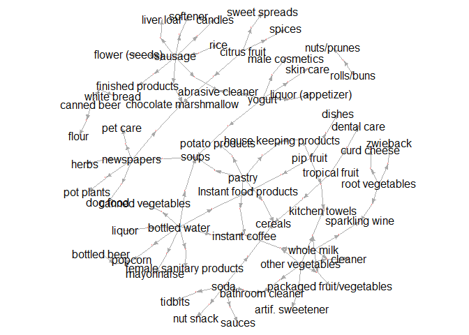
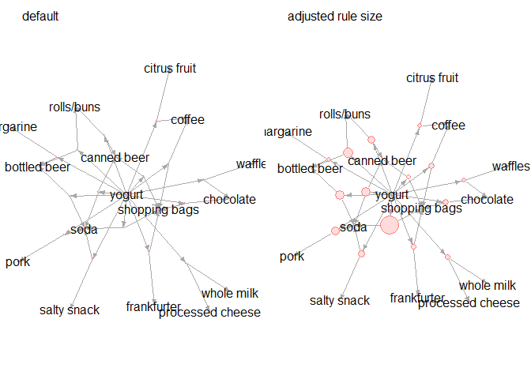

## Overview

R package for getting inspected rules as data.frame.

#### How to use

Just `inspectDF()` instead of `arules::inspect()` after `arules::apriori()`.


```r
require(dplyr)
require(arules)
require(inspectDF)

data(Groceries)
params <- list(confidence=0.001, support=0.001, maxlen=7, minlen=2)
glo.apriori <- apriori(Groceries, parameter = params, control = list(verbose=FALSE))
print(glo.apriori)
#> set of 40943 rules

glo.inspectDF  <- inspectDF(glo.apriori)
glo.inspectDF %>% str
#> 'data.frame':	40943 obs. of  8 variables:
#>  $ rule      : chr  "Rule 1" "Rule 2" "Rule 3" "Rule 4" ...
#>  $ LHS       : chr  "whole milk" "other vegetables" "other vegetables" "rolls/buns" ...
#>  $ RHS       : chr  "sparkling wine" "artif. sweetener" "bathroom cleaner" "nuts/prunes" ...
#>  $ n         : num  1 1 1 1 1 1 1 1 1 1 ...
#>  $ support   : num  0.00102 0.00102 0.00102 0.00102 0.00102 ...
#>  $ confidence: num  0.00398 0.00525 0.00525 0.00553 0.00583 ...
#>  $ lift      : num  0.712 1.615 1.914 1.647 1.024 ...
#>  $ count     : num  10 10 10 10 10 10 10 10 10 10 ...
```

**InspectDF** also provides a plot.igraph wrapper utility.


```r
set.seed(0)
glo.inspectDF %>% 
  arrange(support, confidence) %>%
  head(60) %>% 
  plotRuleGraph()
```

<!-- -->


## Detail

#### Installation

You can install the **inspectDF** package from [GitHub](https://github.com/katokohaku/inspectDF).


```r
install.packages("devtools") # if you have not installed "devtools" package
devtools::install_github("katokohaku/inspectDF")
```

The source code for **inspectDF** package is available at

- https://github.com/katokohaku/inspectDF.

#### Motivation

Usually, we `arules::inspect()` to enumerate rules after `arules::apriori()`.

Of cource, we could get data.frame object as side effect of `cat()` on the last line in `inspect()`. However, it can't be done quietly (*Always show all on consol*). 

**!!Don't run following codes with many rules!!**

```r
data(Groceries)
params <- list(confidence=0.001, support=0.001, maxlen=7, minlen=2)
glo.apriori <- apriori(Groceries, parameter = params)
#> Apriori
#> 
#> Parameter specification:
#>  confidence minval smax arem  aval originalSupport maxtime support minlen
#>       0.001    0.1    1 none FALSE            TRUE       5   0.001      2
#>  maxlen target   ext
#>       7  rules FALSE
#> 
#> Algorithmic control:
#>  filter tree heap memopt load sort verbose
#>     0.1 TRUE TRUE  FALSE TRUE    2    TRUE
#> 
#> Absolute minimum support count: 9 
#> 
#> set item appearances ...[0 item(s)] done [0.00s].
#> set transactions ...[169 item(s), 9835 transaction(s)] done [0.00s].
#> sorting and recoding items ... [157 item(s)] done [0.00s].
#> creating transaction tree ... done [0.00s].
#> checking subsets of size 1 2 3 4 5 6 done [0.01s].
#> writing ... [40943 rule(s)] done [0.00s].
#> creating S4 object  ... done [0.01s].
print(glo.apriori)
#> set of 40943 rules
glo.inspect  <- glo.apriori %>% head(10) %>% inspect()
#>      lhs               rhs            support     confidence  lift    
#> [1]  {honey}        => {whole milk}   0.001118454 0.733333333 2.870009
#> [2]  {whole milk}   => {honey}        0.001118454 0.004377238 2.870009
#> [3]  {soap}         => {whole milk}   0.001118454 0.423076923 1.655775
#> [4]  {whole milk}   => {soap}         0.001118454 0.004377238 1.655775
#> [5]  {tidbits}      => {soda}         0.001016777 0.434782609 2.493345
#> [6]  {soda}         => {tidbits}      0.001016777 0.005830904 2.493345
#> [7]  {tidbits}      => {rolls/buns}   0.001220132 0.521739130 2.836542
#> [8]  {rolls/buns}   => {tidbits}      0.001220132 0.006633499 2.836542
#> [9]  {cocoa drinks} => {whole milk}   0.001321810 0.590909091 2.312611
#> [10] {whole milk}   => {cocoa drinks} 0.001321810 0.005173100 2.312611
#>      count
#> [1]  11   
#> [2]  11   
#> [3]  11   
#> [4]  11   
#> [5]  10   
#> [6]  10   
#> [7]  12   
#> [8]  12   
#> [9]  13   
#> [10] 13
glo.inspect %>% str
#> 'data.frame':	10 obs. of  7 variables:
#>  $ lhs       : Factor w/ 7 levels "{cocoa drinks}",..: 2 7 4 7 6 5 6 3 1 7
#>  $           : Factor w/ 1 level "=>": 1 1 1 1 1 1 1 1 1 1
#>  $ rhs       : Factor w/ 7 levels "{cocoa drinks}",..: 7 2 7 4 5 6 3 6 7 1
#>  $ support   : num  0.00112 0.00112 0.00112 0.00112 0.00102 ...
#>  $ confidence: num  0.73333 0.00438 0.42308 0.00438 0.43478 ...
#>  $ lift      : num  2.87 2.87 1.66 1.66 2.49 ...
#>  $ count     : num  11 11 11 11 10 10 12 12 13 13
```

It is noisy when especially `inspect()` a lot of rules or calling in other function.
Therefore, this must be done invisibly.

#### Use case

Arules package privides several utilities such as sort(), subset() and etc. But if rules were provided as data.frame, we can explore them as tidy data. **InspectDF** has a good affinity with tidy schemes, such as `dplyr::arrange()` or `dplyr::filter()` because this returns **only** data.frame.

For example, rules with specific item(s) can be extracted using `stringr::str_detect()`


```r
require(stringr)
rules.lhs  <- glo.inspectDF %>% 
  filter(str_detect(LHS, pattern = "yogurt|sausage")) %>%
  arrange(confidence, lift) %>%
  filter(n > 1) %>% 
  head()
```

By default, rule strings are split by separater `","`. But, items sometimes contain separater characters e.g. **[IUPAC of DHA](https://pubchem.ncbi.nlm.nih.gov/compound/Docosahexaenoic_acid#section=IUPAC-Name)**. In such case, user can change rule-separater freely `sep = string`.
 

```r
glo.apriori %>% 
  inspectDF(sep = "###") %>% 
  filter(n >3) %>% 
  select(2:3) %>% 
  head()
#>                                                        LHS         RHS
#> 1 root vegetables###other vegetables###whole milk###yogurt     waffles
#> 2 root vegetables###other vegetables###whole milk###yogurt       sugar
#> 3 root vegetables###other vegetables###whole milk###yogurt      onions
#> 4 root vegetables###other vegetables###whole milk###yogurt butter milk
#> 5  tropical fruit###other vegetables###whole milk###yogurt   margarine
#> 6  tropical fruit###other vegetables###whole milk###yogurt      grapes
```

Similar to original `plot.rules` with `igraph` in arules package, each rule size represents **support** value. This size can be adjusted by `adujust.support.size` in plot functions. 


```r
require(stringr)
rules.lhs  <- glo.inspectDF %>% 
  filter(str_detect(RHS, pattern = "yogurt")) %>%
  arrange(confidence, lift) %>%
  filter(n > 1) %>% 
  head(15)

s=5
set.seed(s)
rules.lhs %>% plotRuleGraph(label = "default")
```

<!-- -->

```r
set.seed(s)
rules.lhs %>% plotRuleGraph(label = "adjusted rule size", 
                            adujust.support.size = 4000)
```

<!-- -->

```r
require(stringr)
rules.lhs  <- glo.inspectDF %>% 
  filter(str_detect(RHS, pattern = "yogurt")) %>%
  arrange(confidence, lift) %>%
  filter(n > 1) %>% 
  head(15)

rules.lhs
#>          rule                         LHS    RHS n     support confidence
#> 1   Rule 7989   canned beer,shopping bags yogurt 2 0.001118454 0.09821429
#> 2  Rule 31170           soda,bottled beer yogurt 2 0.002135231 0.12574850
#> 3  Rule 13529   frankfurter,shopping bags yogurt 2 0.001220132 0.14814815
#> 4  Rule 20442        coffee,shopping bags yogurt 2 0.001423488 0.15217391
#> 5  Rule 26699      rolls/buns,canned beer yogurt 2 0.001728521 0.15315315
#> 6  Rule 31223            soda,canned beer yogurt 2 0.002135231 0.15441176
#> 7  Rule 29426                   pork,soda yogurt 2 0.001931876 0.16239316
#> 8  Rule 22978            soda,salty snack yogurt 2 0.001525165 0.16304348
#> 9   Rule 2458      margarine,bottled beer yogurt 2 0.001016777 0.16666667
#> 10 Rule 32635     rolls/buns,bottled beer yogurt 2 0.002338587 0.17164179
#> 11 Rule 38217          soda,shopping bags yogurt 2 0.004270463 0.17355372
#> 12 Rule 13816 whole milk,processed cheese yogurt 2 0.001220132 0.17391304
#> 13  Rule 9106         citrus fruit,coffee yogurt 2 0.001118454 0.17460317
#> 14 Rule 20625     chocolate,shopping bags yogurt 2 0.001423488 0.17500000
#> 15  Rule 2605           waffles,chocolate yogurt 2 0.001016777 0.17543860
#>         lift count
#> 1  0.7040361    11
#> 2  0.9014115    21
#> 3  1.0619803    12
#> 4  1.0908385    14
#> 5  1.0978581    17
#> 6  1.1068803    21
#> 7  1.1640938    19
#> 8  1.1687555    15
#> 9  1.1947279    10
#> 10 1.2303914    23
#> 11 1.2440968    42
#> 12 1.2466726    12
#> 13 1.2516197    11
#> 14 1.2544643    14
#> 15 1.2576083    10

edges.lhs <- rules.lhs %>% inspectDF::toEdges()
edges.lhs
#>                from         to n     support confidence      lift count
#> 1         Rule 7989     yogurt 2 0.001118454 0.09821429 0.7040361    11
#> 2        Rule 31170     yogurt 2 0.002135231 0.12574850 0.9014115    21
#> 3        Rule 13529     yogurt 2 0.001220132 0.14814815 1.0619803    12
#> 4        Rule 20442     yogurt 2 0.001423488 0.15217391 1.0908385    14
#> 5        Rule 26699     yogurt 2 0.001728521 0.15315315 1.0978581    17
#> 6        Rule 31223     yogurt 2 0.002135231 0.15441176 1.1068803    21
#> 7        Rule 29426     yogurt 2 0.001931876 0.16239316 1.1640938    19
#> 8        Rule 22978     yogurt 2 0.001525165 0.16304348 1.1687555    15
#> 9         Rule 2458     yogurt 2 0.001016777 0.16666667 1.1947279    10
#> 10       Rule 32635     yogurt 2 0.002338587 0.17164179 1.2303914    23
#> 11       Rule 38217     yogurt 2 0.004270463 0.17355372 1.2440968    42
#> 12       Rule 13816     yogurt 2 0.001220132 0.17391304 1.2466726    12
#> 13        Rule 9106     yogurt 2 0.001118454 0.17460317 1.2516197    11
#> 14       Rule 20625     yogurt 2 0.001423488 0.17500000 1.2544643    14
#> 15        Rule 2605     yogurt 2 0.001016777 0.17543860 1.2576083    10
#> 16      canned beer  Rule 7989 2 0.001118454 0.09821429 0.7040361    11
#> 17    shopping bags  Rule 7989 2 0.001118454 0.09821429 0.7040361    11
#> 18             soda Rule 31170 2 0.002135231 0.12574850 0.9014115    21
#> 19     bottled beer Rule 31170 2 0.002135231 0.12574850 0.9014115    21
#> 20      frankfurter Rule 13529 2 0.001220132 0.14814815 1.0619803    12
#> 21    shopping bags Rule 13529 2 0.001220132 0.14814815 1.0619803    12
#> 22           coffee Rule 20442 2 0.001423488 0.15217391 1.0908385    14
#> 23    shopping bags Rule 20442 2 0.001423488 0.15217391 1.0908385    14
#> 24       rolls/buns Rule 26699 2 0.001728521 0.15315315 1.0978581    17
#> 25      canned beer Rule 26699 2 0.001728521 0.15315315 1.0978581    17
#> 26             soda Rule 31223 2 0.002135231 0.15441176 1.1068803    21
#> 27      canned beer Rule 31223 2 0.002135231 0.15441176 1.1068803    21
#> 28             pork Rule 29426 2 0.001931876 0.16239316 1.1640938    19
#> 29             soda Rule 29426 2 0.001931876 0.16239316 1.1640938    19
#> 30             soda Rule 22978 2 0.001525165 0.16304348 1.1687555    15
#> 31      salty snack Rule 22978 2 0.001525165 0.16304348 1.1687555    15
#> 32        margarine  Rule 2458 2 0.001016777 0.16666667 1.1947279    10
#> 33     bottled beer  Rule 2458 2 0.001016777 0.16666667 1.1947279    10
#> 34       rolls/buns Rule 32635 2 0.002338587 0.17164179 1.2303914    23
#> 35     bottled beer Rule 32635 2 0.002338587 0.17164179 1.2303914    23
#> 36             soda Rule 38217 2 0.004270463 0.17355372 1.2440968    42
#> 37    shopping bags Rule 38217 2 0.004270463 0.17355372 1.2440968    42
#> 38       whole milk Rule 13816 2 0.001220132 0.17391304 1.2466726    12
#> 39 processed cheese Rule 13816 2 0.001220132 0.17391304 1.2466726    12
#> 40     citrus fruit  Rule 9106 2 0.001118454 0.17460317 1.2516197    11
#> 41           coffee  Rule 9106 2 0.001118454 0.17460317 1.2516197    11
#> 42        chocolate Rule 20625 2 0.001423488 0.17500000 1.2544643    14
#> 43    shopping bags Rule 20625 2 0.001423488 0.17500000 1.2544643    14
#> 44          waffles  Rule 2605 2 0.001016777 0.17543860 1.2576083    10
#> 45        chocolate  Rule 2605 2 0.001016777 0.17543860 1.2576083    10
```


