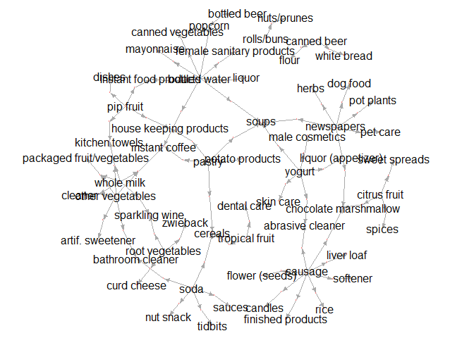
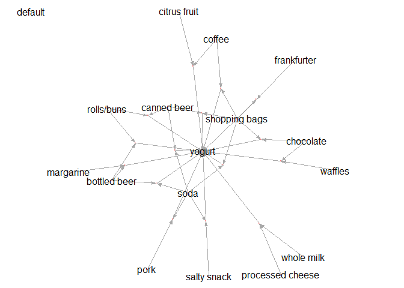

# inspectDF
Satoshi Kato (@katokohaku)

## Overview

R package for getting inspected rules as data.frame.

## example

Just use `inspectDF()` instead of `arules::inspect()` after doing `arules::apriori()`.


```r
require(dplyr)
require(arules)
require(inspectDF)

data(Groceries)
params <- list(confidence=0.001, support=0.001, maxlen=7, minlen=2)
glo.apriori <- apriori(Groceries, parameter = params, control = list(verbose=FALSE))
print(glo.apriori)
#> set of 40943 rules

glo.inspectDF  <- inspectDF(glo.apriori)
```

**InspectDF** also provides a plot.igraph wrapper utility.


```r
set.seed(0)
glo.inspectDF %>% 
  arrange(support, confidence) %>%
  head(60) %>% 
  plotRuleGraph()
```

<!-- -->


### Detail

#### Installation

You can install the **inspectDF** package from [GitHub](https://github.com/katokohaku/inspectDF).


```r
install.packages("devtools") # if you have not installed "devtools" package
devtools::install_github("katokohaku/inspectDF")
```

The source code for **inspectDF** package is available at

- https://github.com/katokohaku/inspectDF.

#### Motivation

Usually, we do `inspect()` to enumrate rules after `arules::apriori()`.

Of cource, we could get data.frame object as side effect of `cat()` in `inspect()`. However, it can't be done quietly (**ALWAYS** show all on consol). It is noisy when using in function or inspect a lot of rules.

#### Use case

Arules package privides several utilities such as sort(), subset() and etc. But if rules were provided as data.frame, we can explore them as tidy data. **InspectDF** has a good affinity with tidy schemes, such as `dplyr::arrange()` or `dplyr::filter()` because this returns **only** data.frame.

For example, rules with specific item(s) can be extracted using `stringr::str_detect()`


```r
require(stringr)
rules.lhs  <- glo.inspectDF %>% 
  filter(str_detect(LHS, pattern = "yogurt|sausage")) %>%
  arrange(confidence, lift) %>%
  filter(n > 1) %>% 
  head()
rules.lhs %>% knitr::kable()
```


rule        LHS                 RHS                        n     support   confidence        lift   count
----------  ------------------  -----------------------  ---  ----------  -----------  ----------  ------
Rule 97     whole milk,yogurt   UHT-milk                   2   0.0010168    0.0181488   0.5425339      10
Rule 98     whole milk,yogurt   red/blush wine             2   0.0010168    0.0181488   0.9444108      10
Rule 99     whole milk,yogurt   house keeping products     2   0.0010168    0.0181488   2.1767518      10
Rule 100    whole milk,yogurt   liver loaf                 2   0.0010168    0.0181488   3.5698730      10
Rule 7175   whole milk,yogurt   chewing gum                2   0.0011185    0.0199637   0.9485170      11
Rule 7176   whole milk,yogurt   cling film/bags            2   0.0011185    0.0199637   1.7530626      11

By default, rule strings are split by separater `","`. But, items sometimes contain separater characters ***e.g. [IUPAC of DHA](https://pubchem.ncbi.nlm.nih.gov/compound/Docosahexaenoic_acid#section=IUPAC-Name)***. In such case, user can change rule-separater freely `sep = string`.
 

```r
glo.apriori %>% 
  inspectDF(sep = "###") %>% 
  filter(n >3) %>% 
  select(2:3) %>% 
  head()
#>                                                        LHS         RHS
#> 1 root vegetables###other vegetables###whole milk###yogurt     waffles
#> 2 root vegetables###other vegetables###whole milk###yogurt       sugar
#> 3 root vegetables###other vegetables###whole milk###yogurt      onions
#> 4 root vegetables###other vegetables###whole milk###yogurt butter milk
#> 5  tropical fruit###other vegetables###whole milk###yogurt   margarine
#> 6  tropical fruit###other vegetables###whole milk###yogurt      grapes
```

Similar to original `plot.rules` with `igraph` in arules package, each rule size represents **support** value. This size can be adjusted by `adujust.support.size` in plot functions. 


```r
require(stringr)
rules.lhs  <- glo.inspectDF %>% 
  filter(str_detect(RHS, pattern = "yogurt")) %>%
  arrange(confidence, lift) %>%
  filter(n > 1) %>% 
  head(15)

par(mfrow = c(1,2))
set.seed(0)
rules.lhs %>% plotRuleGraph(label = "default")
set.seed(0)
rules.lhs %>% plotRuleGraph(label = "adjusted rule size", 
                            adujust.support.size = 4000)
```

<!-- -->

```r
par(mfrow = c(1,1))
```

